# Enabling SSL for a WCF Service

## Introduction

Last week a reader mailed me with some questions about my "[WCF over HTTPS](https://github.com/geersch/WcfOverHttps)" blog post, which I wrote almost 3 years ago.

I created some sample code to help him enable SSL for a WCF service. Last year this was my most popular article, so I thought it would make sense to create a new up-to-date version that shows you step-by-step how to enable SSL for a WCF service with as little fuss as possible.

Let's get started...

## Step 1 - The Service

First we are going to create a simple and easy-to-use WCF service. Start up Visual Studio 2010 and create a new blank solution called "SslEnabledWcfService". Next add a new class library project to it called "CustomerService".

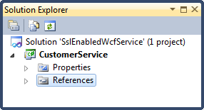

Add a reference to the System.ServiceModel and System.Runtime.Serialization assemblies to the CustomerService project.

Add a new interface called ICustomerService to the project that defines the service contract.

```csharp
[ServiceContract]
public interface ICustomerService
{
    [OperationContract]
    IEnumerable<Customer> GetCustomers();
}
```

The service returns a collection of customers. Each customer is represented by an instance of the Customer class.

```csharp
[DataContract]
public class Customer
{
    [DataMember]
    public Guid Id { get; set; }

    [DataMember]
    public string FirstName { get; set; }

    [DataMember]
    public string LastName { get; set; }
}
```

Go ahead and add a file called Customer.cs. Copy and paste the code listed above.

The actual service implementation is very simple. It returns a list of customers which I create on the fly. No use in dealing with a database, or another persistant data store for this post. Let's keep things as simple as possible.

```csharp
[ServiceBehavior]
public class CustomerService : ICustomerService
{
    private IEnumerable<Customer> LoadCustomers()
    {
        //...
    }

    public IEnumerable<Customer> GetCustomers()
    {
        var customers = new List<Customer>();
        customers.AddRange(LoadCustomers());
        return customers;
    }
}
```

Check out the source code accompanying this post for the full code of the CustomerService class.

## Step 2 - Configuration

OK, now it's time to add some configuration for our service. The host process (IIS) needs this to be able to figure out how to host the service. First add a new application configuration file called Web.config to the CustomerService project.

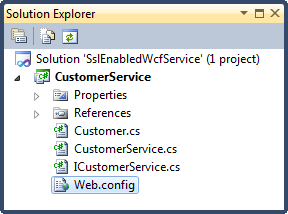

First you need to list the service in the [`<system.serviceModel>`](http://msdn.microsoft.com/en-us/library/ms731354.aspx) node.

```xml
system.serviceModel>
  <services>
    <service name="CustomerService.CustomerService"
              behaviorConfiguration="MyServiceBehavior">

      <endpoint address=""
                binding="basicHttpBinding"
                bindingConfiguration="TransportSecurity"
                contract="CustomerService.ICustomerService" />

      <endpoint address="mex"
                binding="mexHttpsBinding"
                contract="IMetadataExchange" />
    </service>
  </services>

  <!--...-->
</system.serviceModel>
```

As you can see the service is linked to a custom service behavior called "MyServiceBehavior". You need to define this behavior in the [`<behaviors>`](http://msdn.microsoft.com/en-us/library/ms731298.aspx) node of the `<system.serviceModel>` node.

```xml
<behaviors>
  <serviceBehaviors>
    <behavior name="MyServiceBehavior">
      <serviceMetadata httpsGetEnabled="true" httpsGetUrl="" />
      <serviceDebug includeExceptionDetailInFaults="false"/>
    </behavior>
  </serviceBehaviors>
</behaviors>
```

Note that the [httpsGetEnabled](http://msdn.microsoft.com/en-us/library/system.servicemodel.description.servicemetadatabehavior.httpsgetenabled.aspx) property of the behavior is set to true. This allows us to retrieve metadata for the service using an HTTPS/GET request. Handy for creating our client proxies later on.

The first endpoint (non-mex) of the service is also tied to a custom binding (basicHttpBinding) called TransportSecurity.

```xml
<bindings>
    <basicHttpBinding>
      <binding name="TransportSecurity">
        <security mode="Transport">
          <transport clientCredentialType="None" />
        </security>
      </binding>
    </basicHttpBinding>
</bindings>
```

It is on the binding level that you must specify which security model the service uses. Here we set the mode to Transport (SSL) and turn off any type of [client authentication](http://msdn.microsoft.com/en-us/library/system.servicemodel.httptransportsecurity.clientcredentialtype.aspx).

Step 3 - Hosting The Service

The service has been created and configured. Time to host it. I'm using IIS 7.5 (7.5.7600.16385) on Windows 7 for this purpose. Create a new text file called "Service.svc". Note the .svc extension!

Add it to the CustomerService project.

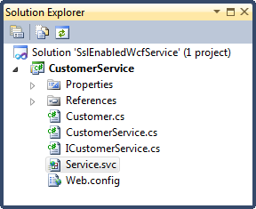

It only contains one line, namely:

```xml
<%@ ServiceHost Language="C#"
                Service="CustomerService.CustomerService"
                CodeBehind="CustomerService.cs" %>
```

Here you identify the service, the language used and the location of the code behind file.

Open up Windows Explorer and navigate to the default installation folder for IIS (C:\\inetpub). I started with a clean installation to make things easy. Since I don't host any other sites locally I deleted everything I found within the wwwroot subfolder. You might want to create a subfolder within the wwwroot folder to host your service. Once you have done so create a new directory called bin within the wwwroot folder or your custom subfolder.

To host the service you must copy the following files to the directory in which you host your service:

- Service.svc
- Web.config
- CustomerService.dll (\\bin)

You must copy the compiled CustomerService.dll assembly (and any other dependent assemblies) inside the bin folder! Just set your solution configuration to Release, rebuild your solution and copy the necessary files as described.


Almost there, we just need to configure IIS. Start up the Internet Information Services (IIS) Manager and navigate to the Default Web Site node in the left pane.

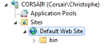

Double click on the Default Document displayed in the middle pane under the IIS group.


Remove all the documents listed there and afterwards add a new document called Service.svc. When we navigate to http://localhost we want IIS to serve up the Service.svc document by default.

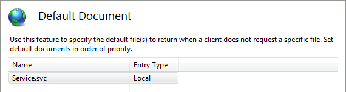

Open your favorite browser (\*cough\* Chrome \* cough\*) and navigate to [http://localhost](http://localhost). You'll be greeted by the following error page:

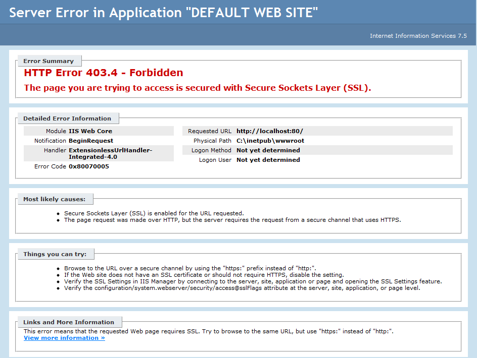

The page is secured and cannot be accessed via http. Exactly what we want! You can try and access it via [https://localhost](https://localhost), but this will result in a page not found error as we have not yet configured SSL.

## Step 4 - SSL Certificate

Before you can configure your service to use SSL you need a valid SSL certificate. Luckily you can create one yourself for development / testing purposes instead of purchasing one. Using the [makecert.exe](<http://msdn.microsoft.com/en-us/library/bfsktky3(v=vs.80).aspx>) command-line utility you can create your own certificates.

Let's quickly create a certificate. Start up an elevated Visual Studio Command Prompt and enter the following command:

```sh
makecert -r -pe -n “CN=YourComputerName” -b 01/01/2012 -e 01/01/2020
-eku 1.3.6.1.5.5.7.3.1 -ss my -sr localMachine -sky exchange -sp
“Microsoft RSA SChannel Cryptographic Provider” -sy 12
```

Make sure to replace the term "YourComputerName" with your actual computer's name. After executing the command you should get a simple "succeeded" message.

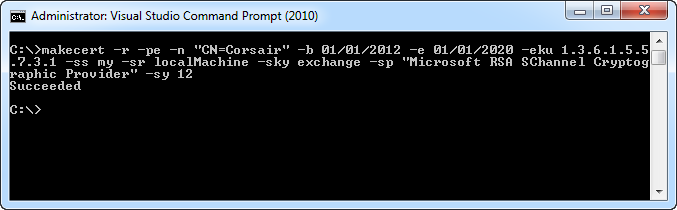

## Step 5 - Enable SSL

Alright, we have our SSL certificate. Let's bind it to our service. Go back to IIS Manager and select the Default Web Site node. In the right pane click on the "Bindings..." link.

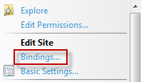

In the Site Bindings popup click on the Add button to add a new binding.

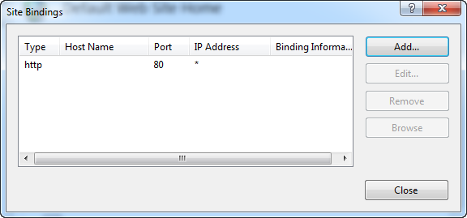

and enter the following data to enable SSL for your site:

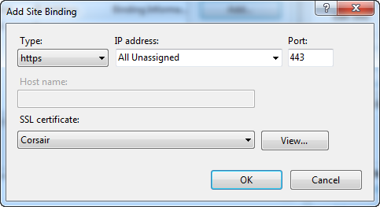

Be sure to select the SSL certificate you created earlier! Just click OK to add the binding and close the Site Bindings popup afterwards.

Restart your web site and navigate to [https://localhost](https://localhost). This time it'll work, but you'll probably get a warning message because of your untrusted SSL certificate. Just ignore it.

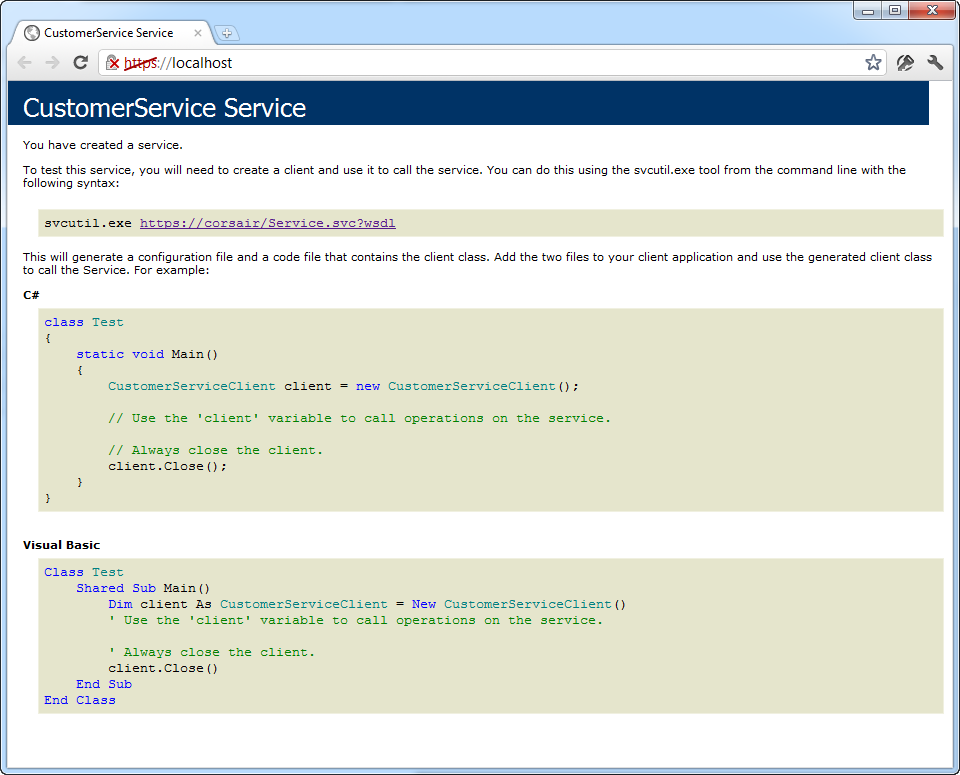]

## Step 6 - Consume The Service

Now that we have our service running in IIS and secured with SSL let's test it. Time to consume the service. Add a new console application to the solution called ClientApp. Add a service reference to our newly created WCF service.

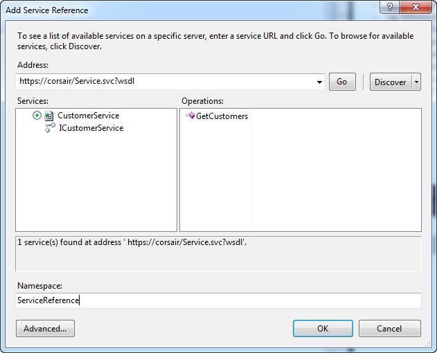

When adding the service reference Visual Studio will report a problem with the SSL certificate.

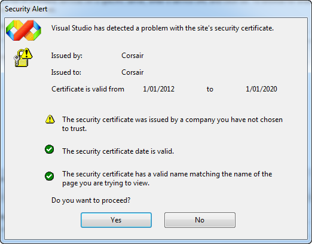

Just click Yes to proceed. The message is shown because the certificate has not been issued by a company you have chosen to trust.

After you've created the service reference you can consume the service. Let's display a list of the customers.

```csharp
using (var proxy = new CustomerServiceClient())
{
    var customers = proxy.GetCustomers();
    foreach(var customer in customers)
    {
        Console.WriteLine(String.Format("{0} {1}", customer.FirstName, customer.LastName));
    }
}
```

When you try to execute this code you'll get the following exception:

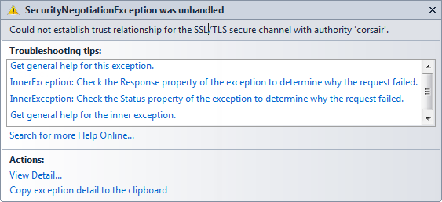

The client application does not trust the service. You can fix this by inspecting the certificate which the service hands over to the client. You need to hook up a handler for the [ServicePointManager's ServerCertifcateValidationCallback](http://msdn.microsoft.com/en-us/library/system.net.servicepointmanager.servercertificatevalidationcallback.aspx).

ServicePointManager.ServerCertificateValidationCallback += customXertificateValidation;

When this callback is triggered you can inspect the server certificate.

```csharp
private static bool customXertificateValidation(object sender, X509Certificate cert,
    X509Chain chain, SslPolicyErrors error)
{
    var certificate = (X509Certificate2) cert;

    // Inspect the server certficiate here to validate
    // that you are dealing with the correct server.
    // If so return true, if not return false.
    return true;
}
```

We're finally there. If you run the client application now it will correctly list the customers returned by the SSL-enabled WCF service.

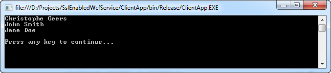
